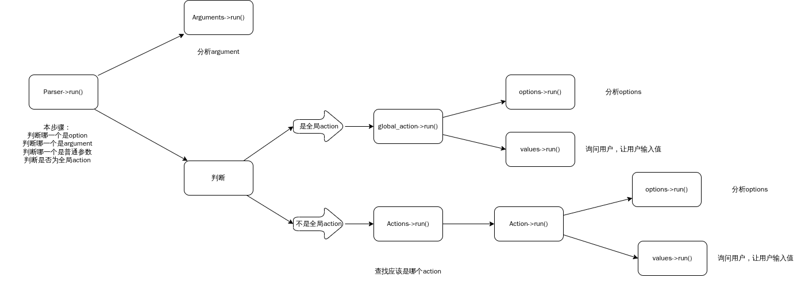

# coc

## 一个基于c++20模块的命令行解析库
main分支是模块版本\
header分支是头文件版本
## 示例
### 编译示例
```bash
git clone -b main https://github.com/dream727/coc
cd coc
xmake
```
这里使用了xmake，因为现在的cmake还不支持c++20模块的构建,如果使用的编译器是msvc是可以使用cmake的
### 然后运行
```bash
target/coc test -fs -DBOOL=false -DINT=2233 -DCHAR=c -DSTRING=s -DFLOAT=22.33 argv argv

#得到输出

#程序要求输入一个值，我输入了value1
please input value1:
value1
#程序又要求输入一个值，因为这个值有默认值，我这里选择不输入，当然也可以选择输入
please input value2(default=value2):

options test:
-----------------------------------
foption
soption
-----------------------------------
arguments test
arguments bool test:0
arguments int test:2233
arguments char test:c
arguments string test:s
arguments float test:22.33
-----------------------------------
value test:
default value:value1
value:value2
-----------------------------------
argv test:
argv
argv

```
## 教程
### 示例大体讲解
示例代码：
```cpp
//example.cc

#include <iostream>
#include <vector>
import coc;

using namespace std;
using namespace coc;

void test(Options*o,Arguments*a,Values*v,vector<string>&argv){
    cout<<"-----------------------------------\n";
    cout<<"options test:\n";
    for(auto iter:o->get_list()){
        cout<<iter->name<<"\n";
    }
    cout<<"-----------------------------------\n";
    cout<<"arguments test\n";
    cout<<"arguments bool test:"<<a->getBool("BOOL",true)<<"\n";
    cout<<"arguments int test:"<<a->getInt("INT",-1)<<"\n";
    cout<<"arguments char test:"<<a->getChar("CHAR",'t')<<"\n";
    cout<<"arguments string test:"<<a->getString("STRING","string")<<"\n";
    cout<<"arguments float test:"<<a->getFloat("FLOAT",-1.1f)<<"\n";

    cout<<"-----------------------------------\n";
    cout<<"value test:\n";
    cout<<"default value:"<<v->getString("value1")<<"\n";
    cout<<"value:"<<v->getString("value2")<<"\n";

    cout<<"-----------------------------------\n";
    cout<<"argv test:\n";
    for(auto &iter:argv){
        cout<<iter<<'\n';
    }
}

int main(int argc,char**argv) {
    ParserConfig *config = new ParserConfig;
    Log *log = new Log;
    Parser parser(config, log);
    parser.addAction("test", "this is a test", test)
            ->addOption("foption", "this is a option", 22, 'f')
            ->addOption("soption", "this is a option", 33, 's')
            ->addValue("value1", "please input value1", "string", "this is a value")
            ->addValue("value2", "please input value2", "string", "this is a value", "value2");
    parser.addArgument("BOOL", "bool", "this is a bool argument")
            ->addArgument("INT", "int", "this is a int argument")
            ->addArgument("CHAR", "char", "this is a char argument")
            ->addArgument("STRING", "string", "this is a string argument")
            ->addArgument("FLOAT", "float", "this is a float argument");

    return parser.run(argc, argv);
}
```
这段代码看起来非常吓人，但其实大部分都是cout等用来调试的打印语句，让我们先从main函数开始。\
main函数的前三行都是在创建对象，第一个创建了一个配置，第二个是Log,第三个是最主要的parser。\
接下来的几行代码都是在向parser中添加配置。\
最后递归式调用了一个`run()`，在`run()`中又分别调用了其他的`run()`来对命令行进行解析并执行对应的action_fun
`run()`的调用关系可以看看下图（名词在接下来的教程中会详细讲解）

>接下来的教程在这段代码的前提下运行
```cpp
#include <iostream>
#include <vector>
import coc;

int main(int argc,char**argv){
    coc::ParserConfig config=new coc::ParserConfig;
    coc::Log=new coc::Log
    coc::Parser parser=coc::Parser(config,log);
    //如果没有特殊说明这里就是以下要写代码的位置


    return parser.run(argc,argv);
}
```
### ParserConfig
这是一个没有成员函数的结构体，用于一些差异性配置
|属性|类型|作用|默认值|
|----|----|----|----|
|is_help_logs|bool|是否使用默认help命令|true|
|intellisense|bool|是否使用智能命令报错|true|
|is_global_action|bool|是否使用全局action|true|
|is_exit_if_not_found_option|bool|如果输入不存在的action是否直接退出|true|
|argument_need_extern|bool|是否能输入未声明的全局参数|true|
|logo_and_version|std::string|程序版本和logo等|"coc v1.0.0"|
|argument_mark|char|全局参数识别符|'D'|
### Log
这是一个没有成员属性的函数的集合，可以通过继承的方式对其中一些log进行修改
|函数名|参数|执行条件|效果|
|----|----|----|----|
unidentifiedArgument|const string& argument|当argument_need_extern为false时且输入未声明的全局参数|打印错误|
unidentifiedOption|const string& option|当is_exit_if_not_found_option为true时且输入了未声明的option|打印错误|
unidentifiedOption|char option|当输入的是缩写的option且满足上面的条件|打印错误|
noValueEntered|const string& value|当未给一个没有默认值的value赋值时|打印错误|
notFoundAction|const string& action|当输入一个不存在的value时|打印错误|
valueLog|const string &value_log,const string& default_value|当需要获取value时|询问value|
下面是一个修改示例：
```cpp
//外部
struct MyLog:public coc::Log{
    inline void notFoundAction(const string& action) override{
            printf("Error:There isn't action:%s.\n"action.c_str());
    }
};
//创建Parser时
coc::ParserConfig* config=new coc::ParserConfig;
MyLog* my_log=new MyLog;
coc::Parser parser=coc::Parser(config,my_log);
```
当输入action错误时，原本会打印`Error:Not found action:someaction.`
现在会打印`Error:There isn't action.`并且Log中的其他未修改函数不受影响
### Parser
最主要的类，是所有语句的开始。构造函数中要求传入一个config指针和一个log指针，这两个指针在析构函数中会被delete,自身最好不要为指针，如果要使用请使用智能指针或者
```cpp
int main(int argc,char**argv){
    //......
    //......
    int num=parser->run(argc,argv);
    delete parser;
    return num;
}
```
### Action
#### **具体表现**
Action具体表现为`命令 [Action] 其他`\
例如示例`target/coc test -fs -DBOOL=false -DINT=2233 -DCHAR=c -DSTRING=s -DFLOAT=22.33 argv argv`中的test就是一个action。
#### **Actions**
保存所有的Action，Parser中有一个Actions的指针。
#### **为parser创建action**
Action存在于Actions中，Actions可以调用其成员函数`addAction(名字,介绍,触发action时调用的函数,缩写（可省略）)`来添加action,同时返回一个Action指针，然后就可以通过这个Action指针来执行其他操作。Parser对`addAction()`进行了包装，也就是说可以直接`parser.addAction(名字,介绍,触发action时调用的函数,缩写（可省略）)`
### ActionFun
声明为
```cpp
typedef void (*ActionFun)(Options*,Arguments*,Values*,vector<string>&);
```
示例中的test函数就是一个action_fun,函数传入指定的addAction中后，当触发该Action时会调用传入函数。\
参数`Options*,Arguments*,Values*,vector<string>&`能够获取解析后的命令行指令
### Option
#### **具体表现**
option是一个开关，具体表现为`命令 [Action] --option -o -fs` \
上面的`--option`,`-o`,`-fs`都是option,coc中，两个`-`识别为长名称，单个`-`识别为短名称。\
上述的`-fs`等价于`-f -s`。
>全局参数使用`-[ParserConfig]`来识别为，当option与`-[ParserConfig]`同名时，判断为全局参数而不是option
#### **Options**
与Actions和Action的关系一样，Options是Option的包装器，但不与Actions中的`addAction()`一样,`addOption`并不对外暴露，而是通过Action包装的一层`addOption()`来添加Option。Options暴露了一些其他功能性函数，马上就会说到。
#### **为Action创建Option**
通过调用`Action.addOption(名字,介绍,映射值,缩写（可省略）)`参数中的映射值用于获取Option。\
上面说了，`parser.addAction()`返回一个Action指针，而`addOption()`也返回本身的Action，因此，我们可以通过链式调用写出类似于这样的代码：
```cpp
//......
parser.addAction(......)
      ->addOption(......)
      ->addOption(......);
```
#### **获取用户输入的Option**
在action_fun中有一个Option的指针，可以通过这个指针来获取Option。\
例如，首先在自己的action_fun的参数列表中写下`Options*o,Arguments*a,Values*v,vector<string>&argv`然后就可以通过`o->getOption(名字或缩写)`所返回的布尔值来判断是否输入了这个Option，通过`o->at(index)`来获取用户输入的第index的Option的映射值，或者`(*o)[index]`是一样的效果（如果超出范围会返回-1,所以添加Option时，映射值建议不要为-1），也可以用`get_list()`获取用户输入的所有的Option的指针，如果还是不太明白可以通过以下示例理解：
```cpp
void test(Options*o,Arguments*a,Values*v,vector<string>&argv){
    if(o->getOption("option")){
        //用户是否输入了名字叫做option的Option
        //......
    }
    if(o->getOption('o'))
    {
        //如果option的缩写是o则与上面一样的效果
    }
    std::cout<<o->at(0);//打印用户输入的第一个Option的映射值
    //下面两种方式是一样的效果
    std::cout<<(*o)[0];
    std::cout<<o->get_list()[0]->number;
    for(auto i:o->get_list()){
        cout<<i->name<<'\n';//打印用户输入的所有的Option的名字
    }
}
 
```
### Value
#### **具体表现**
Value表现为要求用户输入一个值，实际是调用了一个`getline()`不用`std::cin`或者`scanf()`的原因是这两个只输入回车不会判断为结束，所以无法判断是否启用默认值。
#### **Values**
同Options
#### **为Action添加Value**
与Option类似，通过`Action.addValue(名字,询问的问题,介绍,值类型（无实际作用，只是在help中提醒）,默认值（可省略）)`，也返回一个Action指针。
#### **获取Value**
在action_fun中通过`v.getString(value名字)`，`v.getChar(value名字)`，`v.getInt(value名字)`，`v.getBool(value名字)`，`v.getFloat(value名字)`来获取所输入的值。
>`getBool()`将`"FALSE"||"False"||"false"||"0"`识别为false，其余为true,下面要说的Argument也是一样

示例：
```cpp
void test(Options*o,Arguments*a,Values*v,vector<string>&argv){
    cout<<v->getString("value1");
}

//main函数中
//......
parser.addAction("test","this is a action",test)
      ->addValue("value1","input value1","this is a value","string");
```
编译后终端输入`target\coc test`会打印`input value1:`然后输入完成后回车就会打印出输入的内容，如果将底下那两行代码代码改成`parser.addAction("test","this is a action",test)->addValue("value1","input value1","this is a value","string"，"vvvvvv");`后编译后在执行会打印`input value1(default=value1):`，这个时候直接回车就会打印`vvvvv`

>注意：当用户未给一个没有默认值的Value赋值时会退出并打印错误信息，因此不会存在用户输入错误而导致你在获取Value时报错。Value储存为红黑树，所以在找不到你所要的Value时会调用`value_map.end().getSome()`,所以如果出现类似报错请检查value名字是否输入正确。
### Argument
#### **具体表现**
示例`target/coc test -fs -DBOOL=false -DINT=2233 -DCHAR=c -DSTRING=s -DFLOAT=22.33 argv argv`中的`-DBOOL=false -DINT=2233 -DCHAR=c -DSTRING=s -DFLOAT=22.33`都是Argument，使用`-`加上ParserConfig中的`argument_mark`来识别，优先级高于Option。
#### **Arguments**
与Options和Values类似，但层级比Options与Values低，与Actions层级相同，直接被Parser包含。
#### **为Parser添加Argument**
与Action类似通过`parser.addArgument(名字,类型（无实际作用，仅在help函数中显示）,介绍)`添加，本质也与Actions类似，是parser的包装了一层，但不同的是，Argument中的`addArgument()`是私有的，`parser.addArgument()`返回的是Parser指针。
#### **获取Argument**
与Value类似也是通过调用`get+Type(名字)`的方式获取，不同的是，Argument的获取参数后面有一个默认值，也就是说当获取的值未被赋值或未被声明就会返回默认值，参考以下代码：
```cpp
void test(Options*o,Arguments*a,Values*v,vector<string>&argv){
    std::cout<<a->getString("arg","def");
}
//main函数中
//......
parser.addArgument("arg","string"，"balabalabala")
      ->addAction("test","this is a action",test);
```
编译后终端输入`target/coc test -Darg=abc`，终端会打印出`abc`,当输入`target/coc test -Darg=abc`，终端会打印`def`
### argv
#### **具体表现**
示例`target/coc test -fs -DBOOL=false -DINT=2233 -DCHAR=c -DSTRING=s -DFLOAT=22.33 argv argv`中的`argv argv`都是argv,可以理解为命令中除了Value和Option的内容。
#### **获取argv**
在action_fun中的参数vector\<string\>&来获取，按照输入顺序排序，示例很简单，可以去参考example.cc中的第28~31行代码